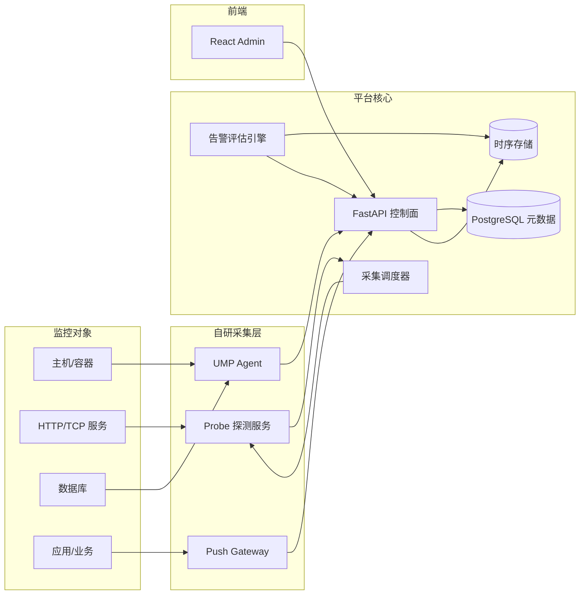
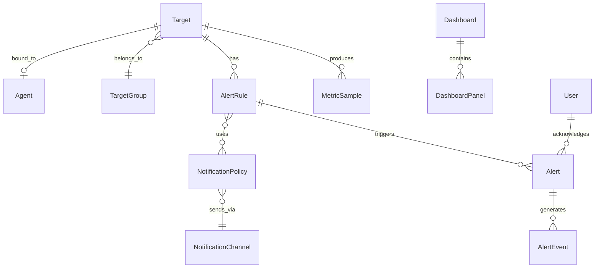

# 统一监控平台方案（UMP）

> 基于现有 FastAPI 全栈管理后台模板，改造为内部运维监控平台。  
> **前提**：监控对象全覆盖、数据来源自研采集、第一期用户为内部运维 5 人。

---

## 目录

- [一、产品定位](#一产品定位)
- [二、现有模板可复用能力](#二现有模板可复用能力)
- [三、系统架构](#三系统架构)
- [四、自研采集架构](#四自研采集架构)
- [五、监控对象全覆盖策略](#五监控对象全覆盖策略)
- [六、功能模块（第一期）](#六功能模块第一期)
- [七、角色与权限](#七角色与权限)
- [八、菜单结构](#八菜单结构)
- [九、核心数据模型](#九核心数据模型)
- [十、前端页面结构](#十前端页面结构)
- [十一、与现有模板的映射](#十一与现有模板的映射)
- [十二、技术栈建议](#十二技术栈建议)
- [十三、交付里程碑](#十三交付里程碑)
- [十四、内测验收标准](#十四内测验收标准)
- [十五、分期扩展规划](#十五分期扩展规划)

---

## 一、产品定位

### 1.1 平台名称

**统一监控平台（UMP / Unified Monitoring Platform）**

### 1.2 服务对象

- 内部运维团队 **5 人**
- 建议配置：1 名平台管理员 + 4 名值班工程师
- 同组织、同权限层级为主，不做多租户

### 1.3 第一期目标（6~8 周）

> 能统一接入主机、HTTP 服务、数据库、业务指标；能配置阈值告警；能 Ack + 邮件/IM 通知；能在一个 Dashboard 看到全局状态。

### 1.4 第一期不做

- 多租户 / 复杂审批流
- AI 根因分析
- 完整日志平台（ELK 级）
- 超细粒度权限（2~3 个角色即可）

---

## 二、现有模板可复用能力

| 现有模块 | 监控平台用法 |
|----------|--------------|
| `User` + JWT 登录 | 运维人员登录 |
| `Role` / `Permission` | 监控模块权限控制（需挂到 API） |
| `Menu` 动态菜单 | 监控模块导航 |
| Admin 用户/权限/菜单页 | 直接复用，扩展权限码 |
| `Items` CRUD | 可替换为「监控目标」或下线 |
| Dashboard `/` | 改造为监控总览 |
| `DataTable` 组件 | 告警列表、目标列表、Agent 列表 |
| SMTP 邮件 | 告警通知渠道 |
| health-check | 扩展为平台健康 + 探测任务 |
| Docker Compose | 后续加 Redis、VictoriaMetrics 等 |

**需要新建**：监控领域模型、时序数据存储、采集 Agent/Probe、告警引擎、Dashboard 图表页。

---

## 三、系统架构



### 架构说明

| 层级 | 职责 |
|------|------|
| **监控对象** | 被观测的基础设施、服务、数据库、业务系统 |
| **自研采集层** | Agent 拉取/Push 指标，Probe 黑盒探测，Push Gateway 接收业务指标 |
| **平台核心** | 控制面 API、任务调度、告警评估、元数据与时序存储 |
| **前端** | React Admin，复用现有模板布局与 RBAC |

---

## 四、自研采集架构

### 4.1 三个采集组件

| 组件 | 职责 | 部署方式 |
|------|------|----------|
| **UMP Agent** | 主机指标、可选 DB 插件、心跳注册 | 每台机器 1 个 |
| **Probe 服务** | HTTP/TCP/ICMP 黑盒探测 | 平台侧 1~2 个实例 |
| **Push Gateway** | 应用/业务指标上报（Token 鉴权） | 平台侧，与 API 同集群 |

### 4.2 设计原则

- Agent **只负责采集 + 上报**，规则配置在平台（控制面/数据面分离）
- 指标格式统一：`metric_name + labels + timestamp + value`
- 所有采集任务由 **Scheduler** 统一调度（Cron + 队列）
- Push/Agent 上报均需 **API Token** 鉴权

### 4.3 时序存储选型

| 方案 | 适用场景 | 建议 |
|------|----------|------|
| **PostgreSQL + 分区表** | < 100 目标、分钟级采集 | **MVP 首选**，与现有栈一致 |
| **VictoriaMetrics 单机** | 指标量增长后 | 第二期平滑迁移 |
| 纯自研 TSDB | 长期 | 成本高，不建议第一期 |

**策略**：元数据用现有 PostgreSQL；指标第一期 PG 分区表，API 抽象好，第二期可换 VictoriaMetrics 而不改业务层。

### 4.4 预置指标规范

```
host.cpu.usage_percent
host.memory.usage_percent
host.disk.usage_percent
host.network.bytes_in
host.network.bytes_out

probe.http.response_time_ms
probe.http.up
probe.tcp.up

db.connections.active
db.connections.max
db.slow_queries.count

app.request.count
app.request.duration_ms
app.request.error_rate

business.{custom_name}
```

---

## 五、监控对象全覆盖策略

**原则**：模型一次设计全，采集分三期实现。

| 监控对象 | 第一期（MVP） | 第二期 | 第三期 |
|----------|---------------|--------|--------|
| **基础设施**（主机/容器） | Agent 采 CPU/内存/磁盘/网络 | Docker/K8s 标签、进程 | 容器编排拓扑 |
| **服务可用性**（HTTP/TCP） | 黑盒探测（存活/延迟/证书） | 多地域探测点 | SLA 报表 |
| **应用性能（APM）** | Push 基础指标（QPS/延迟/错误率） | Trace ID 关联 | 分布式链路 |
| **数据库** | MySQL/PG 连接数、慢查询计数 | 表空间、复制延迟 | 自动巡检 |
| **业务指标** | HTTP Push 自定义指标 | 指标字典 + 审批 | 业务大盘 |
| **日志/事件** | 事件时间线（部署/重启/告警） | 轻量日志检索 | 日志关联排障 |

---

## 六、功能模块（第一期）

### 6.1 监控总览 `/`

**用户故事**：值班人员打开首页，30 秒内知道「有没有事」。

| 功能 | 说明 | 优先级 |
|------|------|--------|
| 健康概览卡片 | 正常 / 告警 / 离线目标数 | P0 |
| 活跃告警 Top 10 | 按级别排序，一键 Ack | P0 |
| 核心趋势图 | CPU / 可用率 / 错误率（24h） | P0 |
| 目标状态分布 | 按 env / team 标签饼图 | P1 |
| 最近事件流 | 告警触发/恢复、Agent 离线 | P1 |

---

### 6.2 监控目标 `/targets`

**统一模型**：所有类型均为 `Target`，用 `type` 区分。

| type | 第一期能力 |
|------|------------|
| `host` | Agent 绑定、主机指标 |
| `http` | URL、方法、期望状态码、超时 |
| `tcp` | host:port 连通性 |
| `database` | 连接串（加密存储）、基础指标 |
| `business` | Push 端点 + Token |
| `custom` | 预留扩展 |

**页面**：

- 目标列表（筛选：类型 / 状态 / 标签 / 分组）
- 目标详情（指标迷你图 + 最近告警 + Agent 心跳）
- 批量导入（CSV）

**config_json 示例**：

```json
// type = http
{
  "url": "https://api.example.com/health",
  "method": "GET",
  "expected_status": 200,
  "interval_sec": 60
}

// type = database
{
  "driver": "postgresql",
  "host": "db.internal",
  "database": "app",
  "check_interval_sec": 300
}

// type = business
{
  "push_token_id": "xxx",
  "expected_metrics": ["order.count", "payment.fail_rate"]
}
```

---

### 6.3 指标中心 `/metrics`

| 功能 | 说明 |
|------|------|
| 指标目录 | 预置 + 自定义指标名规范 |
| 指标 Explorer | 选目标/指标/时间范围 → 折线图 |
| 预置指标包 | host.* / probe.* / db.* / app.* |

---

### 6.4 告警中心 `/alerts`

**第一期必须闭环**：规则 → 触发 → 通知 → Ack → 恢复。

| 子模块 | 路径 | 功能 |
|--------|------|------|
| 活跃告警 | `/alerts/active` | 列表、筛选、Ack、备注 |
| 告警规则 | `/alerts/rules` | 阈值规则 CRUD |
| 告警历史 | `/alerts/history` | 已恢复告警归档 |
| 静默 | `/alerts/silences` | 维护窗口（按目标静默 N 小时） |

**规则类型（第一期）**：

- 静态阈值：`cpu > 80% 持续 5min`
- 存活探测：`probe.http.up == 0 持续 1min`
- 无数据告警：`5min 无上报`

**告警级别**：P0 致命 / P1 严重 / P2 警告 / P3 提示

---

### 6.5 通知 `/notifications`

| 功能 | 第一期 |
|------|--------|
| 邮件 | 复用现有 SMTP |
| 企业 IM Webhook | 钉钉 / 飞书 / 企微 |
| 通知策略 | P0→IM+邮件，P1→IM，P2→邮件 |
| 值班表 | 固定 5 人轮值（简化版，无复杂升级链） |
| 通知记录 | 发送成功/失败日志 |

---

### 6.6 仪表盘 `/dashboards`

| 功能 | 说明 |
|------|------|
| 预置大盘 | 基础设施 / 服务可用性 / 业务概览 |
| 自定义大盘 | 添加 Panel（折线 / Gauge / Stat / 表格） |
| 变量 | env、target_group 下拉 |
| 分享 | 5 人团队全员可见 |

---

### 6.7 事件中心 `/events`（轻量版）

不做完整日志平台，只做 **运维事件时间线**：

| 事件类型 | 来源 |
|----------|------|
| `alert.fired` / `alert.resolved` | 告警引擎 |
| `agent.offline` / `agent.online` | Agent 心跳 |
| `target.created` / `target.updated` | 配置变更 |
| `deploy.manual` | 人工录入（可选） |

---

### 6.8 系统管理 `/admin`（复用 + 扩展）

| 现有 | 监控扩展 |
|------|----------|
| 用户管理 | 5 个运维账号 |
| 角色权限 | 简化为 2 角色 |
| 菜单管理 | 挂载监控菜单 |
| — | **Agent 管理** `/admin/agents` |
| — | **API Token** `/admin/tokens` |
| — | **审计日志** `/admin/audit` |

---

## 七、角色与权限

### 7.1 预置角色（5 人团队）

| 角色 | 人数 | 权限 |
|------|------|------|
| `ops_admin` | 1 | 全部 + 系统配置 + 用户管理 |
| `ops_engineer` | 4 | 目标/规则/告警/仪表盘读写，无用户管理 |

### 7.2 权限码

```
dashboard:read

targets:read
targets:write

metrics:read

alerts:read
alerts:ack
alerts:manage

dashboards:read
dashboards:write

notifications:read
notifications:manage

events:read

agents:read
agents:manage

audit:read
system:manage
```

---

## 八、菜单结构

```
监控总览                    /
├── 监控目标                /targets
├── 指标查询                /metrics
├── 告警中心
│   ├── 活跃告警            /alerts/active
│   ├── 告警规则            /alerts/rules
│   ├── 告警历史            /alerts/history
│   └── 静默策略            /alerts/silences
├── 仪表盘                  /dashboards
├── 事件中心                /events
├── 通知与值班
│   ├── 通知渠道            /notifications/channels
│   ├── 通知策略            /notifications/policies
│   └── 值班表              /notifications/oncall
└── 系统管理
    ├── 用户管理            /admin
    ├── 角色权限            /admin/permissions
    ├── 菜单管理            /admin/menus
    ├── Agent 管理          /admin/agents
    ├── API Token           /admin/tokens
    └── 审计日志            /admin/audit
```

---

## 九、核心数据模型

### 9.1 实体列表

| 实体 | 说明 |
|------|------|
| `Target` | 监控目标（type, name, labels, status, config_json） |
| `TargetGroup` | 目标分组 |
| `Agent` | Agent 注册（host_id, version, last_heartbeat, status） |
| `MetricDefinition` | 指标定义（name, unit, type, description） |
| `MetricSample` | 时序点（target_id, metric, labels, ts, value） |
| `AlertRule` | 告警规则（target/group, expr, duration, severity） |
| `Alert` | 告警实例（rule_id, status, fired_at, ack_by, resolved_at） |
| `AlertEvent` | 告警状态变更事件 |
| `Silence` | 静默规则 |
| `NotificationChannel` | 通知渠道（email, webhook） |
| `NotificationPolicy` | 通知策略（severity → channel） |
| `NotificationLog` | 发送记录 |
| `Dashboard` | 仪表盘 |
| `DashboardPanel` | 面板配置 |
| `AuditLog` | 审计日志 |
| `ApiToken` | Push / Agent 鉴权 Token |

### 9.2 实体关系（简图）



---

## 十、前端页面结构

| 路径 | 页面 | 说明 |
|------|------|------|
| `/` | 监控总览 | 替代现有空白 Dashboard |
| `/targets` | 目标列表 | DataTable + 筛选 |
| `/targets/:id` | 目标详情 | 指标图 + 告警 + 事件 |
| `/metrics` | 指标 Explorer | 时间范围 + 折线图 |
| `/alerts/active` | 活跃告警 | Ack + 备注 |
| `/alerts/rules` | 告警规则 | 规则 CRUD |
| `/alerts/history` | 告警历史 | 归档查询 |
| `/alerts/silences` | 静默管理 | 维护窗口 |
| `/dashboards` | 仪表盘列表 | 预置 + 自定义 |
| `/dashboards/:id` | 仪表盘详情 | 全屏模式 |
| `/events` | 事件时间线 | 轻量事件流 |
| `/notifications/channels` | 通知渠道 | 邮件 / Webhook |
| `/notifications/policies` | 通知策略 | 级别路由 |
| `/notifications/oncall` | 值班表 | 5 人轮值 |
| `/admin/agents` | Agent 管理 | 注册 / 心跳 / 版本 |
| `/admin/tokens` | API Token | Push 鉴权 |
| `/admin/audit` | 审计日志 | 变更记录 |
| `/admin` | 用户管理 | 复用现有 |
| `/admin/permissions` | 角色权限 | 复用现有 |
| `/admin/menus` | 菜单管理 | 复用现有 |
| `/settings` | 个人设置 | 增加通知偏好 |

---

## 十一、与现有模板的映射

### 11.1 改造优先级

| 阶段 | 改造内容 |
|------|----------|
| **第一批** | 数据模型 + Target CRUD + 菜单/权限 seed + 替换 Dashboard |
| **第二批** | Agent + Probe + 时序写入 + 告警引擎 |
| **第三批** | 通知 + 指标 Explorer + 仪表盘 |
| **第四批** | Push Gateway + 业务指标 + 审计 |

### 11.2 可下线模块

- `Items` 演示模块（`/items`）→ 替换为 `/targets` 或过渡期并存

### 11.3 权限体系注意

现有 `require_permission()` 已定义但未挂到路由，改造时应统一 enforcement，避免继续依赖 `is_superuser` 硬编码。

---

## 十二、技术栈建议

| 层 | 选型 |
|----|------|
| 控制面 API | 现有 FastAPI + SQLModel |
| 元数据 | 现有 PostgreSQL |
| 指标存储 | PG 分区表（MVP）→ VictoriaMetrics（二期） |
| 任务调度 | APScheduler 或 Celery + Redis |
| Agent | Go 单二进制（推荐）或 Python |
| 实时推送 | 第一期轮询 30s；二期 WebSocket |
| 前端图表 | Recharts 或 ECharts |
| 通知 | SMTP + Webhook |

---

## 十三、交付里程碑

| 周次 | 交付物 |
|------|--------|
| W1 | 数据模型 + Target CRUD + 菜单/权限 seed |
| W2 | Agent 心跳注册 + 主机指标上报 + TSDB 写入 |
| W3 | Probe HTTP/TCP 探测 + Scheduler |
| W4 | 告警规则引擎 + 活跃告警列表 + Ack |
| W5 | 邮件 + IM 通知 + 监控总览页 |
| W6 | 指标 Explorer + 预置仪表盘 + 事件时间线 |
| W7 | Push Gateway + 业务指标 + DB 基础采集 |
| W8 | 联调、文档、5 人内测、Bug 修复 |

---

## 十四、内测验收标准

1. 接入 ≥ 10 台主机 Agent，指标 1 分钟可见
2. 配置 ≥ 20 个 HTTP 探测，失败 1 分钟内告警
3. 业务方 Push 1 个自定义指标并触发告警
4. 告警 Ack 后 IM/邮件通知可达
5. 总览页 30 秒内反映全局状态变化

---

## 十五、分期扩展规划

### Phase 2 — 可用（8~12 周）

- Agent 插件化（Docker/K8s/DB 深度采集）
- 自定义仪表盘完善
- 告警规则可视化编辑器
- 静默与维护窗口增强
- VictoriaMetrics 迁移
- WebSocket 实时告警推送

### Phase 3 — 平台化

- 日志检索 / 事件关联
- 多环境隔离
- 告警智能聚合、根因分析
- 大屏展示、报表导出
- 开放 API / Webhook 集成
- SLA / SLO 管理

### 可选扩展

- 拓扑图（服务依赖）
- 变更管理（发布与告警关联）
- 工单集成（Jira / 禅道）
- 移动端告警推送
- AI 异常检测与告警摘要

---

## 附录：5 人团队运维友好设计

| 痛点 | 设计对策 |
|------|----------|
| 人少事多 | 预置规则模板（主机/HTTP/DB 一键套用） |
| 夜班交接 | 告警 Ack 必须写备注；事件时间线可导出 |
| 误报多 | 静默 + 「持续 N 分钟」才触发 |
| 工具分散 | 统一入口，Push/Agent/Probe 均进同一平台 |
| 权限简单 | 2 角色够用，不做复杂 RBAC |

---

*文档版本：v1.0 | 基于内部运维 5 人、自研采集、监控对象全覆盖前提整理*
